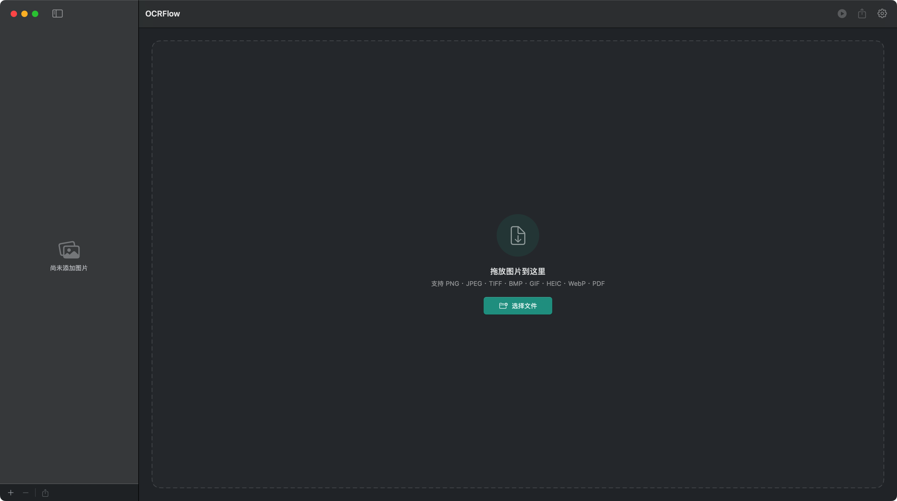
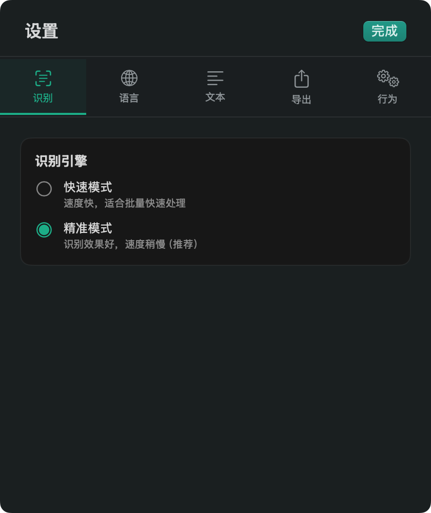

# OCRFlow

A native macOS app for batch OCR (Optical Character Recognition) and document parsing. Choose between Apple's Vision framework, a full PaddleOCR PP-OCRv6 pipeline on ONNX Runtime, or the PaddleOCR-VL-1.6 vision-language model running locally through llama.cpp. Fast, private, and works entirely offline.


## Screenshots




## Features

- **Batch processing** — drag and drop multiple images or entire folders at once
- **Three OCR engines** — Apple Vision (fast / accurate), PaddleOCR PP-OCRv6, or PaddleOCR-VL-1.6
- **Document parsing** — the PaddleOCR-VL engine runs the official two-stage pipeline: layout analysis finds the blocks and their reading order, the VLM reads each one with the prompt that suits it (text, table, formula, chart, seal), and the results are reassembled as Markdown
- **Full PaddleOCR pipeline** — text detection, document and text-line orientation correction, and CTC recognition, with per-line boxes and confidence scores drawn over the preview
- **Three model tiers** — tiny / small / medium, from 6 MB to 139 MB, swappable without restarting
- **Tunable** — every PP-OCR parameter (detection resolution, binarisation and box thresholds, unclip ratio, batch sizes, minimum confidence) is exposed in Settings
- **Multi-language** — one PP-OCRv6 model reads 50 languages: Simplified and Traditional Chinese, English, Japanese and 46 Latin-script languages. Korean, Arabic, Cyrillic, Thai, Greek and Devanagari install in one click from the built-in model manager
- **In-app model manager** — download the `medium` tier and extra language models from inside the app, with a mainland-China mirror
- **Text post-processing** — merge line breaks, remove empty lines, trim whitespace, fix hyphenated words
- **Flexible export** — export all results as a single text file with configurable separators
- **Fully offline** — the PaddleOCR models ship inside the app; images are never uploaded and nothing leaves your machine. The only network access is the optional model download you start yourself
- **macOS-native** — built with SwiftUI, feels right at home on macOS

## Requirements

- macOS 14.0 (Sonoma) or later — required by the ONNX Runtime build that powers PaddleOCR
- Apple Silicon or Intel Mac

### Building from source

Two sets of binaries are fetched by script rather than committed: the pinned
llama.cpp xcframework the PaddleOCR-VL engine links against, and the ONNX models
that ship inside the bundle.

```bash
Scripts/fetch-llama-xcframework.sh
Scripts/fetch-paddleocr-models.sh bundled
```

Run both once after cloning, before opening the Xcode project. Pass `--source`
to the first to build llama.cpp yourself instead (needs `cmake`).

## Installation

### Option 1 — Download DMG (Recommended)

1. Go to the [Releases](../../releases) page
2. Download the latest `OCRFlow-<version>.dmg`
3. Open the DMG and drag **OCRFlow.app** to your Applications folder

Releases are signed with a Developer ID certificate and notarised by Apple, so
they open normally — no right-click-to-open, and no Gatekeeper warning. The app
checks for updates on its own and can install them in place; you can also ask it
to look via **OCRFlow → 检查更新…**.

### Option 2 — Build from Source

```bash
git clone https://github.com/yb311/OCRFlow.git
cd OCRFlow
Scripts/fetch-llama-xcframework.sh
Scripts/fetch-paddleocr-models.sh bundled
open OCRFlow.xcodeproj
```

Then press **⌘R** in Xcode to build and run.

## Usage

1. Drag images (PNG, JPG, TIFF, PDF) into the app, or click **+** in the sidebar
2. (Optional) Open **Settings** to choose OCR engine, languages, and post-processing options
3. Click **开始识别** (Start OCR) in the toolbar
4. View results in the detail panel; copy or export as needed

When PaddleOCR is the active engine, the preview also shows the detected text
boxes, tinted by confidence. Toggle them with the viewfinder button above the
preview.

## PaddleOCR

PaddleOCR is the default engine. The app bundles the PP-OCRv6 **tiny** and
**small** tiers and runs them locally through ONNX Runtime:

| Stage | Model | Size |
| --- | --- | --- |
| Document orientation (optional) | `PP-LCNet_x1_0_doc_ori` | 6.8 MB |
| Text-line orientation | `PP-LCNet_x0_25_textline_ori` | 1.0 MB |
| Text detection (DB) | `PP-OCRv6_{tier}_det` | 1.8 / 9.9 / 62 MB |
| Text recognition (CTC) | `PP-OCRv6_{tier}_rec` | 4.5 / 21 / 77 MB |

### Model tiers

| Tier | Size | Bundled | Notes |
| --- | --- | --- | --- |
| `tiny` | 6 MB | ✅ | Fastest. 49 languages — no Japanese |
| `small` | 31 MB | ✅ | Default. Balanced speed and accuracy |
| `medium` | 139 MB | Download | Most accurate; beats PP-OCRv5 server at a fraction of the size |

Switching tier also restores that tier's reference detection thresholds, which
differ between tiers — PP-OCRv6 detects at `thresh` 0.2 and `unclip_ratio` 1.4,
where PP-OCRv5 used 0.3 and 1.5.

The models are the official ONNX exports published by PaddlePaddle, and the
Swift implementation follows PaddleOCR's own pre- and post-processing
(`DetResizeForTest`, `DBPostProcess`, `get_rotate_crop_image`, `CTCLabelDecode`)
so that results track the reference pipeline.

### Orientation correction

PP-OCR's detector is trained on upright text and finds very little on a page
that was scanned sideways. Two independent stages handle this:

- **Text-line orientation** (on by default, near-zero cost) flips individual
  lines that are upside down.
- **Whole-page orientation** (off by default) detects a page rotated by
  90°/180°/270° and straightens it before detection. Turn it on for scans and
  photographed documents. It is off by default because the classifier is
  unreliable on images that are not documents, where a wrong guess would rotate
  a perfectly good image.

### Installing other models

Open **Settings → Paddle → 模型管理** and click download. Everything lands in
`~/Library/Application Support/OCRFlow/Models`, and a file there overrides the
bundled model of the same name. Both Hugging Face and an `hf-mirror.com` mirror
are offered, since Hugging Face is often unreachable from mainland China.

Available there:

- the **`medium`** tier
- **PP-OCRv5 single-language recognisers** for the scripts PP-OCRv6 has no
  release for — Korean, Cyrillic, East Slavic, Arabic, Devanagari, Greek,
  Tamil, Telugu and Thai. DB detection is script-agnostic, so these pair with
  the PP-OCRv6 detector; only the recogniser is swapped. Their character
  dictionary is extracted from the model's `inference.yml` by the app.

The same models can be installed from the command line:

```bash
# PP-OCRv6 medium
Scripts/fetch-paddleocr-models.sh medium

# A single-language recogniser
Scripts/fetch-paddleocr-models.sh lang korean
Scripts/fetch-paddleocr-models.sh list

# Refresh the models that ship inside the bundle
Scripts/fetch-paddleocr-models.sh bundled
```

Delete the files from that folder — or press 删除 in the model manager — to fall
back to the built-in models.

## PaddleOCR-VL

PaddleOCR-VL-1.6 is a 0.9B vision-language model. It reads handwriting, tables,
formulas, charts and seals that the CTC-based PP-OCR pipeline cannot, and it
returns a structured document rather than a list of lines.

It is **not** a drop-in replacement for PP-OCRv6: it is slower, it needs about a
gigabyte of weights downloaded first, and PaddlePaddle is explicit that the model
alone is only half of it —

> to fully leverage the capabilities of PaddleOCR-VL, it is necessary to adopt
> the complete pipeline that integrates layout analysis and VLM-based
> recognition, rather than using the VLM component alone

So the app implements the whole pipeline:

1. **Layout analysis** — PP-DocLayoutV3 (ONNX Runtime) finds the blocks that make
   up the page, classifies them into 25 kinds, and predicts the reading order.
2. **Per-block recognition** — each block goes to the VLM with the prompt that
   matches it: `OCR:`, `Table Recognition:`, `Formula Recognition:`,
   `Chart Recognition:` or `Seal Recognition:`.
3. **Reassembly** — the blocks are emitted in reading order as Markdown, with
   titles as headings, formulas in `$$`, tables as HTML and figures as
   placeholders.

Skipping stage 1 is possible (**Settings → VL → 版面分析**), and it is much
faster, but it loses content: on a dense Korean poster the single-shot path
silently dropped the title and the first three paragraphs that the full pipeline
recovers.

### Models

Downloaded from **Settings → VL → 模型管理**; nothing is bundled.

| Model | Size | Notes |
| --- | --- | --- |
| PP-DocLayoutV3 | 131 MB | Layout analysis. Required |
| PaddleOCR-VL-1.6 Q4 | 898 MB | Community quantisation (Q4_K_M text, Q8_0 vision) |
| PaddleOCR-VL-1.6 F16 | 1.8 GB | PaddlePaddle's own weights, accuracy baseline |

The VLM runs on Metal through llama.cpp. On an Apple Silicon Mac a 31-block
newspaper page parses in about 10 seconds.

### Compute backend

CPU is the default and the recommended setting. A Core ML backend is available
in Settings, but PP-OCR's detection and recognition graphs have dynamic input
shapes, which Core ML recompiles per shape; in practice it produces identical
text several times more slowly.

## Project Structure

```
OCRFlow/
├── OCRFlowApp.swift          # App entry point
├── ContentView.swift         # Root view + Settings sheet
├── Models/
│   └── ImageItem.swift       # Data model for a single image item
├── ViewModels/
│   └── OCRViewModel.swift    # Main state & OCR logic
├── Views/
│   ├── SidebarView.swift     # File list sidebar
│   ├── DetailView.swift      # Preview + OCR result panel + box overlay
│   ├── DropZoneView.swift    # Empty-state drop zone
│   ├── ModelManagerView.swift # Download / remove optional models
│   └── DropHelper.swift      # Drag-and-drop handling
├── PaddleOCR/
│   ├── PPOCREngine.swift              # Pipeline orchestration
│   ├── PPTypes.swift                  # Config, results, errors
│   ├── PPModelStore.swift             # Bundled + user-installed model lookup
│   ├── PPModelCatalog.swift           # Downloadable models and their sources
│   ├── PPModelDownloader.swift        # Streaming download + atomic install
│   ├── PPDictionary.swift             # Charset extraction from inference.yml
│   ├── PPSession.swift                # ONNX Runtime wrapper
│   ├── PPDocOrientationClassifier.swift
│   ├── PPDetector.swift               # DB detection + post-processing
│   ├── PPTextLineClassifier.swift
│   ├── PPRecognizer.swift             # CTC decoding
│   ├── PPImageBuffer.swift            # BGR buffer, resize, perspective crop
│   ├── PPGeometry.swift               # Convex hull, min-area rect
│   └── PPConnectedComponents.swift    # Region extraction for DB
├── Layout/                   # Stage 1 of PaddleOCR-VL
│   ├── PPLayoutTypes.swift            # 25 block classes, label → prompt routing
│   ├── PPLayoutDetector.swift         # PP-DocLayoutV3 pre/post-processing
│   ├── PPReadingOrder.swift           # Model order key, XY-cut fallback
│   └── PPDocumentAssembler.swift      # Blocks → Markdown
├── PaddleVL/                 # Stage 2 of PaddleOCR-VL
│   ├── VLTypes.swift                  # Tasks, model variants, config
│   ├── VLModelStore.swift             # GGUF + layout model lookup
│   ├── VLImageBuffer.swift            # CGImage → RGB8 for mtmd
│   ├── VLEngine.swift                 # llama.cpp + mtmd wrapper
│   └── VLDocumentPipeline.swift       # Layout → per-block VLM → assembly
├── Updates/
│   └── UpdaterController.swift        # Sparkle updater, menu and settings state
└── Resources/PaddleOCR/      # Bundled ONNX models + character dictionary
```

Releases are built and published by GitHub Actions; see
[docs/RELEASING.md](docs/RELEASING.md).

## Contributing

Pull requests are welcome! For major changes, please open an issue first to discuss what you would like to change.

1. Fork the repo
2. Create a feature branch (`git checkout -b feature/amazing-feature`)
3. Commit your changes (`git commit -m 'Add amazing feature'`)
4. Push to the branch (`git push origin feature/amazing-feature`)
5. Open a Pull Request

## Acknowledgements

- [PaddleOCR](https://github.com/PaddlePaddle/PaddleOCR) — the PP-OCRv6 and
  PP-LCNet models bundled in this app are the official ONNX exports from the
  [PaddlePaddle](https://huggingface.co/PaddlePaddle) organisation on Hugging
  Face, licensed under the Apache License 2.0.
- [PaddleOCR-VL-1.6](https://huggingface.co/PaddlePaddle/PaddleOCR-VL-1.6) and
  [PP-DocLayoutV3](https://huggingface.co/PaddlePaddle/PP-DocLayoutV3) — Apache-2.0.
- [ONNX Runtime](https://github.com/microsoft/onnxruntime) — MIT License.
- [llama.cpp](https://github.com/ggml-org/llama.cpp) — MIT License. Used as a
  prebuilt xcframework for the PaddleOCR-VL engine.

## License

This project is licensed under the MIT License — see [LICENSE](LICENSE) for details.
The bundled PaddleOCR models remain under their own Apache-2.0 license.
